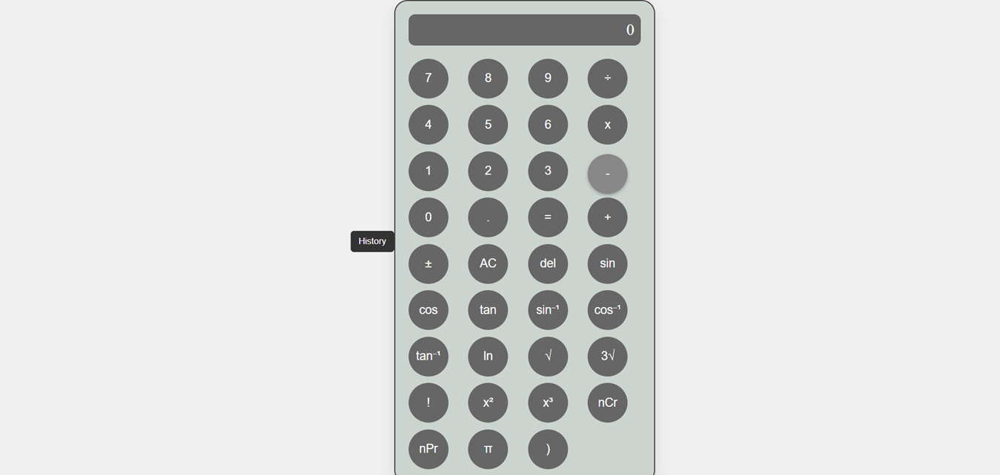

# 🧮 **Bluebird Calculator**  
> **A Simple and Stylish Web-Based Calculator**  

  

---

## 🌟 **About Bluebird Calculator**  

**Bluebird Calculator** is a sleek and user-friendly web-based calculator designed for everyday calculations. Built with **HTML, CSS, and JavaScript**, it provides a smooth and responsive experience, making it perfect for quick mathematical operations.  

🔹 **Simple & Clean UI**  
🔹 **Basic Arithmetic Operations (+, -, ×, ÷)**  
🔹 **Responsive Design for Mobile & Desktop**  
🔹 **Fast & Lightweight**  

---

## 🖼️ **Screenshots**  

| Calculator Interface |
|----------------------|
|  |

---

## 🚀 **Live Demo**  

🔗 **Try it here:** [Bluebird Calculator](https://sayanmajumder1.github.io/Bluebird-Calculator/)  

---

## 🛠️ **Tech Stack**  

✅ **HTML** – Structure of the calculator  
✅ **CSS** – Styling and UI Design  
✅ **JavaScript** – Logic and Functionality  

---

## 🎯 **Features**  

✅ **Basic Calculations** – Perform addition, subtraction, multiplication, and division  
✅ **Responsive Layout** – Works on both desktop and mobile devices  
✅ **Clean & Minimal UI** – Distraction-free experience  
✅ **Lightweight** – Fast and efficient performance  

---

## 📥 **How to Use?**  

1️⃣ Open the [Live Demo](https://sayanmajumder1.github.io/Bluebird-Calculator/) or clone the repository.  
2️⃣ Enter numbers using the on-screen buttons.  
3️⃣ Perform calculations using **+**, **-**, **×**, **÷** operators.  
4️⃣ Press **=** to see the result.  
5️⃣ Click **C** to clear the screen and start a new calculation.  

---

## 📂 **How to Run Locally?**  

1. **Clone the repository:**  
   ```bash
   git clone https://github.com/sayanmajumder1/Bluebird-Calculator.git
   ```
2. **Navigate to the project folder:**  
   ```bash
   cd Bluebird-Calculator
   ```
3. **Open `index.html` in a browser:**  
   ```bash
   start index.html
   ```  
   *(or just double-click `index.html` to open in a browser.)*  

---

## 🤝 **Contributing**  

Want to improve **Bluebird Calculator**? Follow these steps:  

1. **Fork** the repository  
2. **Clone** your fork  
3. **Create a new branch**  
4. **Make changes & commit**  
5. **Push your branch & create a Pull Request**  

---

## 📬 **Contact & Support**  

📧 **Email:** sayanmajumder566@gmail.com  
🌐 **GitHub:** [Sayan Majumder](https://github.com/sayanmajumder1)  

---

### 🌟 **If you find this project useful, please give it a star ⭐ on GitHub!**  

---

Let me know if you need modifications! 🚀
